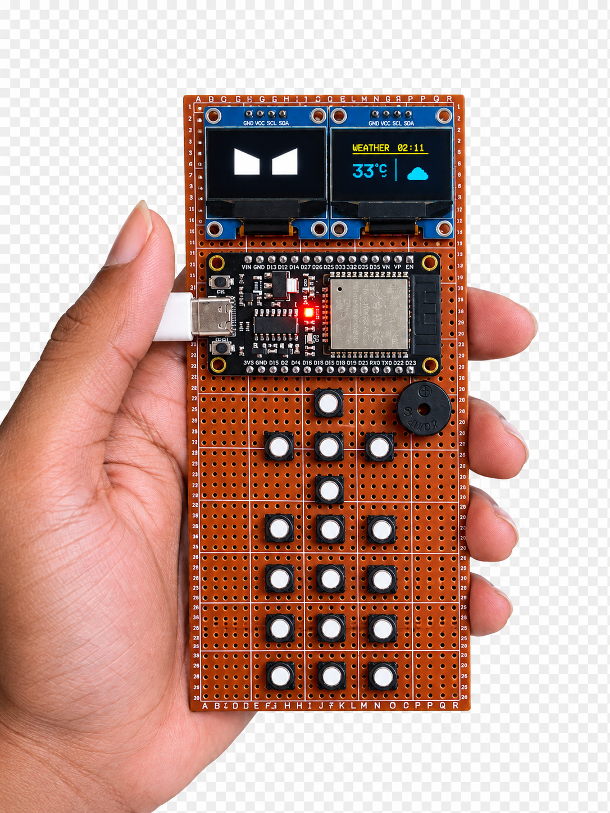

# Tanvir's ESP32 Macro Keyboard v3.0

A professional multi-function Macro Keyboard and App platform built with an **ESP32**, **2 I2C OLED displays**, **5 push buttons (Up/Down/Left/Right/Center)**, a **4x3 Matrix Keypad**, and a **Buzzer**. 

The system operates as a unified platform with multiple "Apps" (layers) including an iOS Macro layer for typing names/passwords over BLE, a WiFi Scanner, a Ping Monitor, a Settings Menu, Media Controls, and even Games like Snake and Pong.

---

## 📁 Project Structure (PlatformIO)

This project has been migrated to PlatformIO for a clean, modular architecture.

| Directory / File | Description |
|------------------|-------------|
| `src/main/Macro-Keyboard.ino` | Main entry point and global sketch functions |
| `include/` | Header files for global state and definitions |
| `apps/` | Application modules (iOS Macro, Games, Media, Ping Monitor, Nokia, etc.) |
| `system/` | Core system modules (Input handling, App Manager) |
| `data/` | Data structures (e.g., auto-generated 1000 names array) |
| `lib/` | Third-party and custom libraries (like `HijelHID_BLEKeyboard`) |
| `tools/` | Build scripts and python utilities |
| `platformio.ini` | PlatformIO configuration and library dependencies |

---

## 🔌 Hardware Setup & Wiring

| Component | ESP32 Pin / Details |
|-----------|---------|
| **Microcontroller** | ESP32 (ESP32-D0WD-V3 rev 3.1) |
| **Display 1 (Main UI)** | 128x64 I2C OLED (Address `0x3C`)   **SDA:** `D32` \| **SCL:** `D33` |
| **Display 2 (Big Text)** | 128x64 I2C OLED (Address `0x3C`)   **SDA:** `D21` \| **SCL:** `D22` |
| **Direct Buttons** | Active LOW Push Buttons   **Btn 1 (Up):** `D12`   **Btn 2 (Down):** `D13`   **Btn 3 (Left):** `D14`   **Btn 4 (Right):** `D27`   **Btn 5 (Center):** `D26` |
| **Matrix Keypad** | Standard 4x3 Matrix Keypad   **Rows:** `19`, `18`, `5`, `16`   **Cols:** `4`, `25`, `23` |
| **Buzzer** | Piezo Buzzer on `D2` |
| **Wireless** | Dual-stack (Bluetooth BLE for HID, WiFi for networking apps) |

---

## 🎮 App Layers & Controls

The keyboard uses an **App Manager** to switch between different functionalities. 
- **Hold the `*` key on the Matrix Keypad for 2 seconds** to return to the Main Menu from any app.
- **Hold Center Button for 5 seconds** to trigger the Bad Apple animation.
- **Hold Center Button briefly** to cycle between turning on/off the Dual OLED displays to save power.

### 📱 Layer 1: iOS Macros (Profiles)
Connects as a Bluetooth keyboard ("Tanvir's Keyboard") to a phone or PC and uses the **Matrix Keypad** for macros:
- **Key 1:** Types First Name + Last Name
- **Key 2:** Fills out birthdate/gender dropdown forms (Day, Month, Year 1991-2006)
- **Key 0:** Generates a new random profile (Name + 16 char Password)
- **Key 3:** Types random Username (First + Last + random digits)
- **Key 4:** Types Password (human-speed typing simulation)
- **Key 5:** Save to Notes (Spotlight -> Notes -> Paste clipboard -> Stamp timestamp -> Type Password)
- **Key 6:** Clear History (Spotlight shortcut)
- **Key 7:** Random USA Time Zone (Spotlight -> Date & Time -> selects a random USA City)

### 🌐 Layer 2: WiFi Analyzer
Scans for nearby WiFi networks and displays their SSID and signal strength (RSSI) on the dual screens.

### 🏓 Layer 6: Games
Play classic games on the dual OLEDs!
- **Snake:** Use the directional buttons to eat food and grow.
- **Pong:** Play against a bot using Up/Down buttons.

### ⚙️ Layer 7: Settings
- Switch between Dark/Light mode logic.
- View connected WiFi details and Web Portal IP.
- Connect to saved networks automatically.

### 📈 Layer 9: Ping Monitor
Connects to WiFi and constantly pings Google (8.8.8.8) to check latency. Displays a live scrolling graph of your internet stability.

---

## 🛡️ Anti-Bot Detection (Human Typing)

When typing macros (like passwords or names), the keyboard types character-by-character with randomised delays to bypass bot detection scripts:
- **Base delay:** Gaussian distributed 38–110ms per keystroke (~40–90 WPM)
- **Human Error:** 5% chance of making a typo and immediately backspacing it.
- **Cognitive Pauses:** Pre-word pause (70–200ms) and hesitation bursts.
- **Muscle Memory:** Faster typing for common character pairs (digraphs).

---

## 🚀 How to Build & Upload

This project uses **PlatformIO**. It will automatically download all required libraries (`NimBLE-Arduino`, `Adafruit SSD1306`, `ArduinoJson`, `Keypad`, etc.).

1. Install [PlatformIO IDE](https://platformio.org/) (VSCode extension recommended).
2. Open the `Macro-Keyboard` folder.
3. Click the **Upload** button (or run `pio run -t upload` in the terminal).

*Built by Tanvir | Powered by ESP32*
